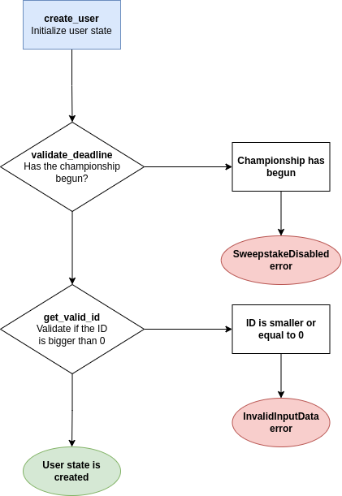
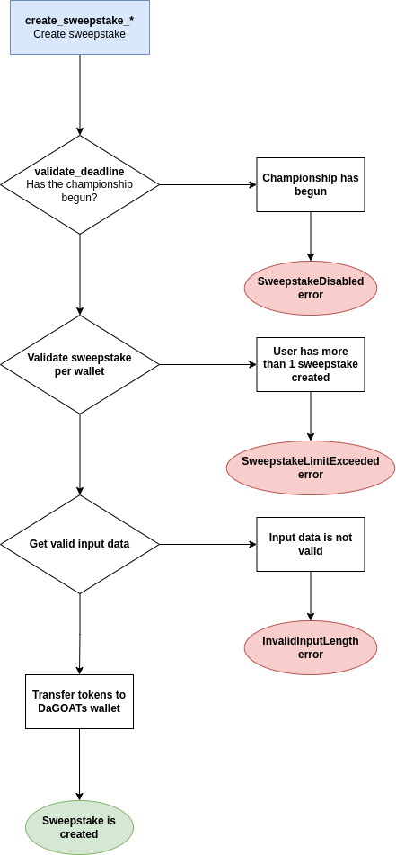

# Sweepstake program

Solana smart contract of DaGOATs Sweepstake

## Usage

- Devnet program ID: `7fjExfzR1qVGjj3bQDmDnHGs5fshPFE1nEZdCbCWCaed`

```shell
# use specific versions of anchor, node and rust
avm use 0.25.0
nvm use 16
rustup default nightly

# install dependencies and build program
anchor build

# run tests
anchor test

# deploy
anchor deploy --provider.cluster <mainnet|devnet>
```

## How does it work

There are two major RPCs:

1. `create_user` for creating the user state
2. `create_sweepstake_*` for creating the sweepstake with specified "payment method" (SOL, GOAT token ...)

### Happy path scenario

#### 1. Initialize user state

This method should be called after the user is created on the backend side (`POST /api/v1/users`) because it requires the `user_id` parameter which is user's ID from the SQL database



#### 2. Create sweepstake

The method name (e.g. `create_sweepstake_sol`) depends on the token in which user wants to pay the sweepstake

This method should be called after the sweepstake is created on the backend side (`POST /api/v1/sweepstakes`) because it requires the sweepstake ID parameter which is sweepstake ID from the SQL database


